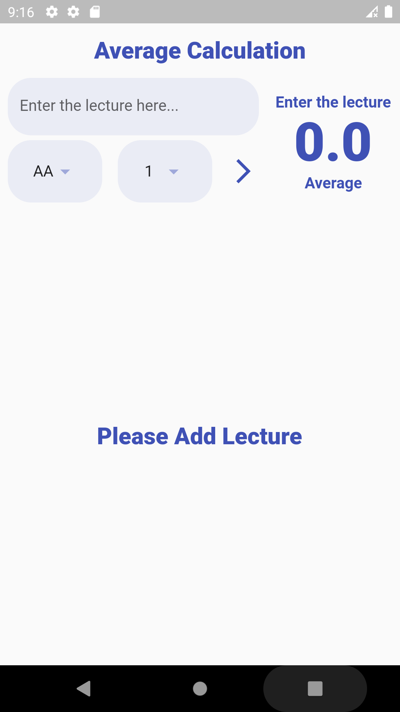
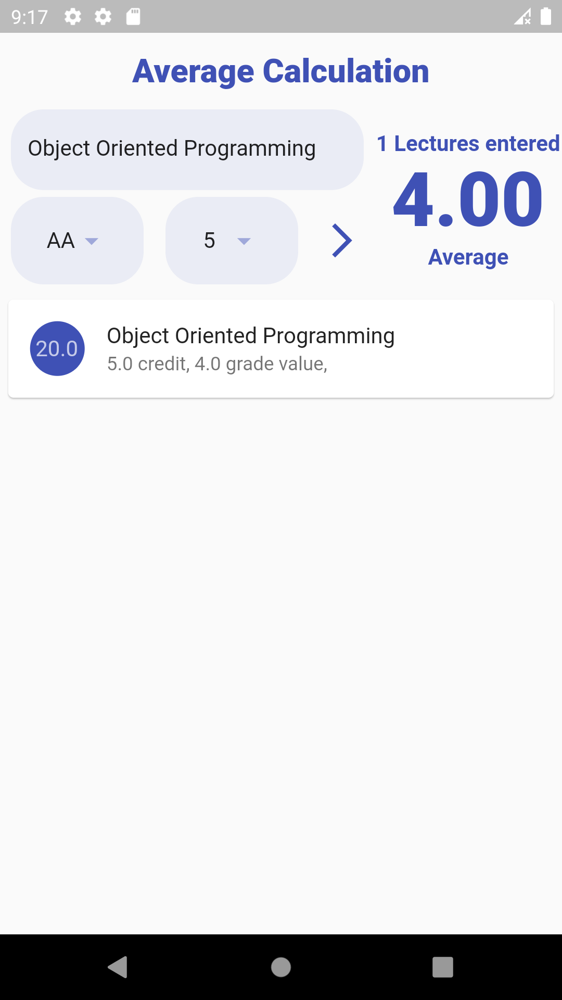
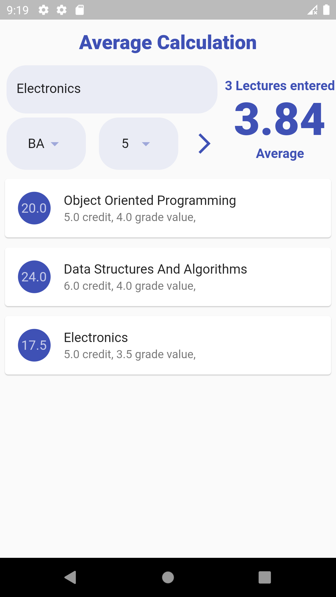
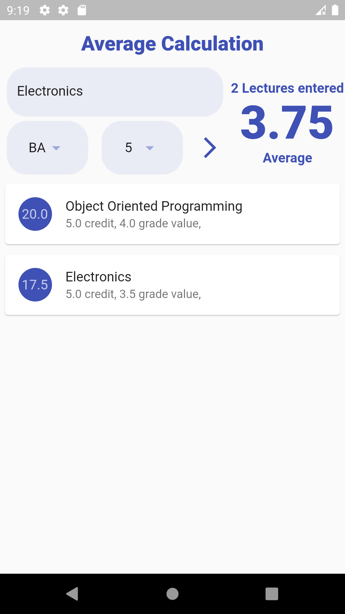

# GPA

<h2>(AA = 4, BA = 3.5, BB = 3, CB = 2.5, CC = 2, DC = 1.5, DD = 1, FD 0.5, FF = 0) that can be used in schools using the lettering style mean calculation system, course name, lettering and A dynamic application that calculates the average by entering the loan value.</h2>

<h3>Default Home Page</h3>                                                                                                                         

<h3>After adding a lecture</h3>

<h3>After adding more lectures</h3>

<h3>After adding more and more lectures</h3>

<h3>After removing lecture or lectures</h3>

<h3>Getting Started</h3>

This project is a starting point for a Flutter application.

A few resources to get you started if this is your first Flutter project:

- [Lab: Write your first Flutter app](https://docs.flutter.dev/get-started/codelab)
- [Cookbook: Useful Flutter samples](https://docs.flutter.dev/cookbook)

For help getting started with Flutter development, view the
[online documentation](https://docs.flutter.dev/), which offers tutorials,
samples, guidance on mobile development, and a full API reference.
